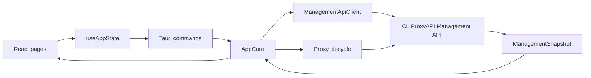

# Quotio Desktop Development Plan

## 项目定位

当前项目：

```text
D:\项目\quotio-desktop
```

参考项目：

```text
D:\项目\quotio-master
```

`quotio-desktop` 是新的跨平台 Tauri 实现。`quotio-master` 是原 macOS SwiftUI 项目，只作为行为、数据契约、页面流程和代理资源参考，不直接修改。

## 总体目标

把原 macOS Quotio 迁移为跨平台桌面应用，形成以下闭环：

- 本地代理生命周期管理。
- Management API 数据读取和配置写入。
- Dashboard / Providers / Quota / Logs / Settings 核心 UI。
- Fallback / Agents / Remote connection 等高级入口。
- 真实代理二进制运行态验证。
- Windows / macOS / Linux 平台适配和打包回归。

## 架构边界

```text
apps/desktop            React + Tauri UI shell
apps/desktop/src-tauri  Tauri command bridge and desktop runtime
crates/quotio-types     Shared data contracts
crates/quotio-core      App state, proxy lifecycle, Management API
crates/quotio-platform  OS-specific adapters
resources/proxy         Platform-specific CLIProxyAPI binaries
```

## 数据流



## 推进原则

- 不修改 `D:\项目\quotio-master`。
- 不提交、不清理、不回退未跟踪内容，除非明确要求。
- 每个阶段先做最小可验证闭环，再做交互细节。
- 前端继续以 `ManagementSnapshot` 为主数据源。
- 写操作统一通过 Tauri 命令桥进入 Rust，不把 management secret 暴露给前端。
- 真实代理二进制接入前，运行态验证以契约测试、构建和缺二进制状态为准。

## 当前进度

| 阶段 | 状态 | 范围 |
|---|---:|---|
| Proxy lifecycle core | Completed | 平台二进制解析、启停、重启、健康检查、missing binary、crash/error 状态、资源诊断。 |
| Management API | Completed | DTO、Rust client、AppCore 快照回写、Tauri 命令桥；Remote Management 外部代理已跑通。 |
| Dashboard | Completed | 代理状态、KPI、Provider 摘要、管理诊断。 |
| Providers | Completed | API key 增删改、auth file 启禁用/删除、OAuth start/poll、Vertex JSON 导入。 |
| Quota | Completed | usage 汇总、账号维度状态、quota-exceeded switch project / preview model。 |
| Logs | Completed | runtime logs、request-log 开关、关键词过滤、错误过滤、最大渲染保护。 |
| Settings | Completed | 应用设置、代理设置、Management API 配置、Proxy URL 控制、Remote connection 状态、运行态与资源诊断。 |
| Secondary pages | Completed | Fallback、Agents、API Keys、Remote connection 已接入主导航和命令桥。 |
| SwiftUI visual alignment | Completed | 参考原 macOS SwiftUI 风格完成第一轮浅色桌面 UI 重皮肤。 |
| Remote Management compatibility | Completed | 外部代理 `http://127.0.0.1:8317` 已通过 key 鉴权、快照刷新、usage/logs 降级、auth-files 差异结构、chunked 响应兼容。 |
| Real local proxy runtime validation | Blocked | 本地托管代理启动/停止/管理快照端到端阻塞于 Windows/Linux 代理二进制缺失。 |
| Platform packaging | Partial | Windows Tauri build、release exe、MSI、NSIS 已生成；托盘、安装包安装流、退出/重开、跨平台回归待完成。 |

## 已完成阶段

### 1. Providers 页面闭环

目标：把只读 Provider 快照升级为账号和 API key 的最小可操作页面。

完成内容：

- API key 新增。
- API key 替换。
- API key 按索引删除。
- Auth file 禁用 / 启用。
- Auth file 删除单个。
- Auth file 删除全部。
- OAuth 获取 URL / state。
- OAuth 状态轮询。
- Vertex service account JSON 导入。
- 所有写操作成功后刷新 `ManagementSnapshot`。

主要文件：

```text
apps/desktop/src/components/sections/ProvidersScreen.tsx
apps/desktop/src/state/useAppState.ts
apps/desktop/src-tauri/src/lib.rs
apps/desktop/src/types.ts
```

### 2. Quota 页面迁移

目标：把 Quota 从总量卡片升级为 provider/account 维度的额度状态页。

完成内容：

- requests / tokens / success rate / failed requests 汇总。
- ready accounts 汇总。
- account 维度状态卡片。
- disabled / unavailable / runtime-only 状态展示。
- quota-exceeded switch project 开关。
- quota-exceeded switch preview model 开关。
- 缺快照或缺二进制时的明确空状态。

主要文件：

```text
apps/desktop/src/components/sections/QuotaScreen.tsx
apps/desktop/src/components/AppShell.tsx
apps/desktop/src/types.ts
apps/desktop/src-tauri/src/lib.rs
```

### 3. Logs 页面迁移

目标：把 Logs 从日志行列表升级为可诊断页面。

完成内容：

- runtime logs 展示。
- 清空日志。
- 刷新管理快照。
- request-log 开关。
- 关键词过滤。
- 错误过滤。
- 只渲染最近 N 条日志，避免大日志拖慢 UI。

主要文件：

```text
apps/desktop/src/components/sections/LogsScreen.tsx
apps/desktop/src/components/AppShell.tsx
apps/desktop/src-tauri/src/lib.rs
```

### 4. Settings 页面迁移

目标：把配置入口集中到 Settings。

完成内容：

- 新增 Settings 导航。
- App settings：运行模式、连接模式、主题、语言、通知、开机启动占位。
- Proxy settings：host、port、remote endpoint、allow remote。
- Management config：debug、routing、request retry、max retry interval、request log、logging-to-file。
- Proxy URL 读取、写入、清空。
- Remote connection 状态归宿。
- 运行态与资源诊断：连接模式、代理资源目录、候选二进制、缺失提示、打包资源路径。

主要文件：

```text
apps/desktop/src/components/sections/SettingsScreen.tsx
apps/desktop/src/components/AppShell.tsx
apps/desktop/src/state/useAppState.ts
apps/desktop/src-tauri/src/lib.rs
```

## 已完成高级阶段与剩余阶段

### 5. Secondary pages and advanced

目标：补齐旧版体验中的高级入口。

完成内容：

- Fallback 页面接入主导航。
- Agents 页面接入主导航。
- API Keys 独立页接入主导航。
- Remote connection 状态归宿到 Settings。
- Agent 检测、配置读取、手动配置输出、自动写入、备份、恢复、重置默认入口完成。
- Fallback 虚拟模型配置、route-cache 状态展示、模型发现 fallback 列表完成。

主要文件：

```text
apps/desktop/src/components/sections/AgentsScreen.tsx
apps/desktop/src/components/sections/FallbackScreen.tsx
apps/desktop/src/components/sections/ApiKeysScreen.tsx
apps/desktop/src/state/useAppState.ts
apps/desktop/src-tauri/src/lib.rs
crates/quotio-core/src/agents.rs
crates/quotio-core/src/agent_config.rs
```

### 6. Real proxy runtime validation

目标：从契约验证进入真实代理闭环。

当前状态：

- Remote Management 外部代理闭环已跑通。
- `http://127.0.0.1:8317` 可规范到 `/v0/management`。
- 明文 management key 通过 Windows Credential Manager 保存，前端不暴露 key。
- Bearer 鉴权已通过。
- Dashboard 可刷新真实管理快照。
- 已兼容外部代理 `/usage` 404 和 `/logs` 400 的可选段降级。
- 已兼容 `/auth-files` 返回整数计数、null、数组或对象结构。
- 已兼容 `Transfer-Encoding: chunked` 响应。
- Windows/Linux 本地托管代理仍阻塞于缺少真实代理二进制。

当前资源状态：

```text
resources/proxy/darwin/cli-proxy-api-plus        present
resources/proxy/windows/cli-proxy-api-plus.exe   missing
resources/proxy/linux/cli-proxy-api-plus         missing
```

本地托管代理待验证：

- 放入真实 Windows/Linux 代理二进制。
- 验证 `missing_binary / stopped / running / crashed / error` 状态转换。
- 验证本地 start / stop / restart / health check。
- 验证本地 ManagementSnapshot 刷新。
- 验证本地 API key / auth files / logs / fallback 写操作闭环。

### 7. Platform packaging and regression

目标：达到跨平台可发布质量。

当前状态：

- Windows Tauri build 已通过。
- release exe 已生成。
- MSI 安装包已生成。
- NSIS 安装包已生成。
- 打包态资源路径注入已接入。
- Settings 已展示运行态与资源诊断。

最新产物：

```text
target/release/quotio-desktop.exe
target/release/bundle/msi/Quotio_0.1.0_x64_en-US.msi
target/release/bundle/nsis/Quotio_0.1.0_x64-setup.exe
```

剩余回归：

- 托盘打开、退出、窗口显示行为。
- 安装包安装流和卸载流。
- 完全退出后重新打开。
- Notifications 权限和测试通知。
- Launch at login 平台行为。
- macOS / Linux 构建和运行态回归。
- 真实代理二进制存在时，从启动到快照刷新的完整本地闭环。

## 验证命令

从项目根目录运行：

```bash
cargo fmt --all
cargo check --workspace
cargo test -p quotio-core
cargo test -p quotio-core management
npm --prefix apps/desktop run build
npm --prefix apps/desktop run tauri build
```

最近一次已验证：

```text
cargo fmt --all: passed
cargo check --workspace: passed
cargo test -p quotio-core: 13 passed
cargo test -p quotio-core management: 9 passed
npm --prefix apps/desktop run build: passed, 47 modules transformed
npm --prefix apps/desktop run tauri build: passed
Windows release exe: generated
Windows MSI installer: generated
Windows NSIS installer: generated
```

## 下一步推荐

优先等待或补入 Windows 代理二进制：

```text
resources/proxy/windows/cli-proxy-api-plus.exe
```

拿到二进制后进入本地托管代理闭环验证：

1. 启动本地托管代理。
2. 验证 `missing_binary / stopped / running / crashed / error` 状态转换。
3. 刷新本地 ManagementSnapshot。
4. 验证本地 API key / auth files / logs / fallback 写操作。
5. 再做托盘、安装包安装流、退出重开和跨平台回归。