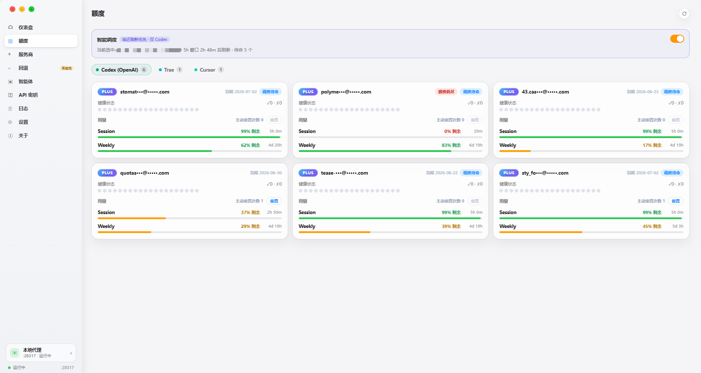
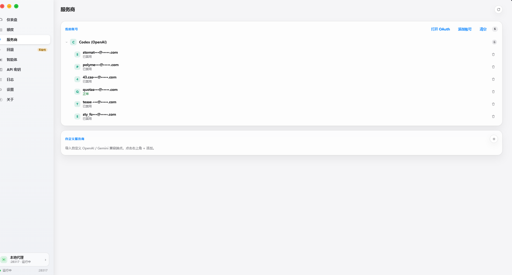
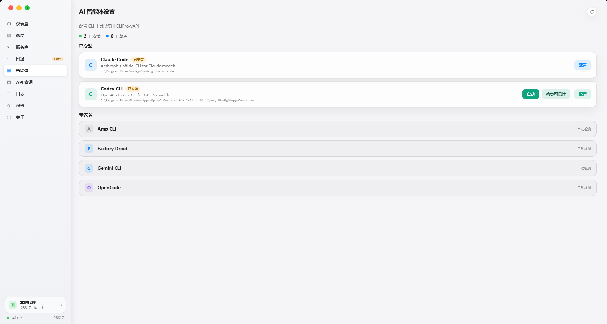
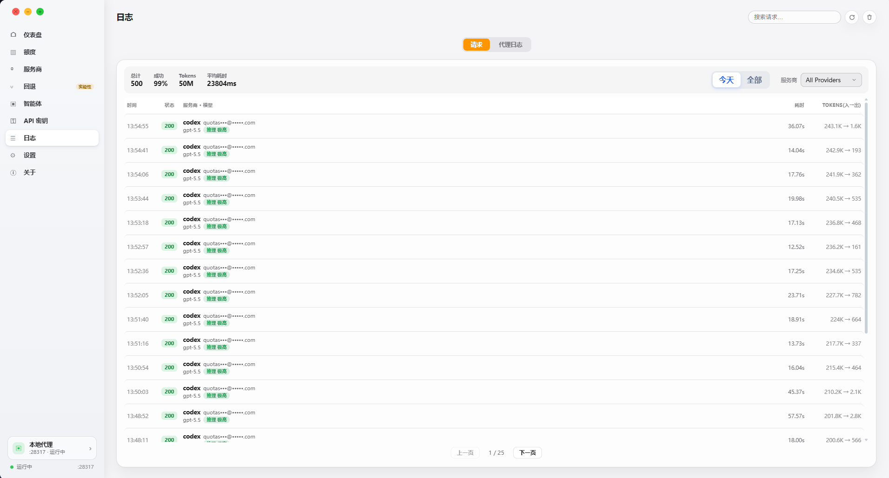
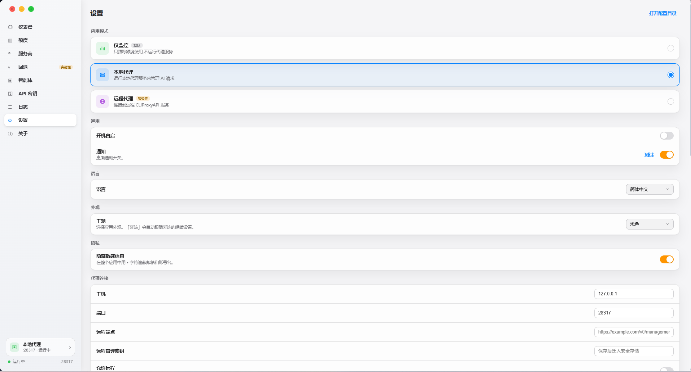

# Quotio

[](https://github.com/xiaocoss/quotio-desktop/releases/latest)

[](https://github.com/xiaocoss/quotio-desktop/releases)
[](https://github.com/xiaocoss/quotio-desktop/stargazers)
[](LICENSE)

**一款跨平台的 AI 账号额度管理工具** —— 通过本地 [CLIProxyAPI](https://github.com/router-for-me/CLIProxyAPI) 代理，统一管理多个 AI 账号的额度与调用，支持多账号轮询、额度监控、智能调度，以及 Codex 多开实例。

目前支持 **Codex (OpenAI)**、**Claude Code**、**GitHub Copilot**、**Gemini CLI**、**Antigravity**、**Kiro**、**Cursor**、**Trae**、**GLM** 等服务商。

> 本项目是 [quotio](https://github.com/nguyenphutrong/quotio)（原 macOS / SwiftUI 版）的跨平台移植，基于 Tauri 重写，一套代码覆盖 macOS / Windows / Linux。

📥 **[下载最新版](https://github.com/xiaocoss/quotio-desktop/releases/latest)** —— macOS / Windows / Linux（或见下方[安装指南](#-安装)）

---

## ✨ 功能

- **多账号管理** —— 一个代理池统一管理多个 AI 账号，自动轮询、按需禁用 / 启用
- **额度监控** —— 每账号展示套餐、到期、5 小时（Session）与每周（Weekly）窗口用量；Codex 额外显示「主动重置次数」并支持**一键重置** 5h 窗口
- **智能调度** —— 「临近刷新优先」：只让 5h 窗口最快刷新的 Codex 账号进池，其余待命，到点自动换号，余量不浪费
- **用量统计** —— 调用数 / 成功率 / Token / 预估花费仪表盘，按账号 / 服务商 / 模型筛选
- **CLI 联动** —— 一键把 Claude Code / Codex / Gemini CLI 等工具指向本地 CLIProxyAPI
- **Codex 多开** —— 多实例绑定不同账号并行运行，互不影响
- **更多** —— 请求日志、回退策略（实验性）、配置备份与去重

## 🖥️ 支持平台

**macOS** · **Windows** · **Linux**

## 🌐 界面语言

简体中文 · English

## 📸 界面预览

<p align="center">
  <br>
  <sub><b>仪表盘 Dashboard</b> —— 调用数、成功率、Token 用量与预估花费，按账号 / 服务商 / 模型筛选</sub>
</p>

<p align="center">
  <br>
  <sub><b>额度 Quota</b> —— 每账号 Session (5h) / Weekly 窗口、套餐、到期，以及 Codex 主动重置次数 + 一键重置</sub>
</p>

<details>
<summary>更多界面 · More screens（服务商 / 智能体 / 日志 / 设置）</summary>

<p align="center">
  <br>
  <sub><b>服务商 Providers</b> —— 多账号 OAuth 代理池管理</sub>
</p>
<p align="center">
  <br>
  <sub><b>智能体 Agents</b> —— 将 Claude Code / Codex / Gemini 等 CLI 指向 CLIProxyAPI</sub>
</p>
<p align="center">
  <br>
  <sub><b>日志 Logs</b> —— 逐请求历史：Token、耗时、状态</sub>
</p>
<p align="center">
  <br>
  <sub><b>设置 Settings</b> —— 应用模式、代理、语言、主题、隐私</sub>
</p>

</details>

## 📦 安装

### 选项 A：下载安装包（推荐）

点下表直达下载 **v0.5.0**，或前往 [**Releases**](https://github.com/xiaocoss/quotio-desktop/releases/latest) 取最新版：

| 平台 | 下载 |
|---|---|
| **Windows** | [`.msi`（推荐）](https://github.com/xiaocoss/quotio-desktop/releases/download/v0.5.0/Quotio_0.5.0_x64_en-US.msi) · [`-setup.exe`](https://github.com/xiaocoss/quotio-desktop/releases/download/v0.5.0/Quotio_0.5.0_x64-setup.exe) |
| **macOS**（Apple Silicon & Intel 通用） | [`.dmg`](https://github.com/xiaocoss/quotio-desktop/releases/download/v0.5.0/Quotio_0.5.0_universal.dmg) |
| **Linux** | [`.deb`](https://github.com/xiaocoss/quotio-desktop/releases/download/v0.5.0/Quotio_0.5.0_amd64.deb) · [`.rpm`](https://github.com/xiaocoss/quotio-desktop/releases/download/v0.5.0/Quotio-0.5.0-1.x86_64.rpm) · [`.AppImage`](https://github.com/xiaocoss/quotio-desktop/releases/download/v0.5.0/Quotio_0.5.0_amd64.AppImage) |

> 上表为 v0.5.0 直链；后续新版请走 [Releases](https://github.com/xiaocoss/quotio-desktop/releases/latest) 页。
> macOS 安装包未签名，若提示「已损坏 / 无法打开」，到「系统设置 → 隐私与安全性」点「仍要打开」即可。

### 选项 B：从源码构建

需先安装 [Node.js](https://nodejs.org)（18+）与 [Rust](https://rustup.rs)。

```bash
git clone https://github.com/xiaocoss/quotio-desktop.git
cd quotio-desktop
npm run desktop:install
npm run desktop:build      # 产物：target/release/ 与 target/release/bundle/
```

## 🔧 开发

```text
apps/desktop/         Tauri + React 桌面应用
crates/
├── quotio-types/     共享数据模型（Provider / 账号 / 额度 / 日志 / 设置）
├── quotio-core/      跨平台代理、状态与管理 API 领域层
└── quotio-platform/  托盘 / 开机自启 / 通知 / 凭据 / 路径 的 OS 适配
```

```bash
npm run desktop:dev            # 开发模式（Tauri）
npm run cargo:check            # Rust 检查
npm run version:set -- minor   # 升版本（major | minor | patch | X.Y.Z），同步全部 4 处版本号
npm run release                # 编译 + 组装便携版（dist-portable/）
```

**发版流程**：`npm run version:set -- <bump>` → 提交 → `git tag vX.Y.Z && git push origin vX.Y.Z`。推送 `v*` 标签会触发 GitHub Actions 自动在 Windows / macOS / Linux 三端构建并发布到对应 Release。

## 🙏 致谢

- **[CLIProxyAPI](https://github.com/router-for-me/CLIProxyAPI)** —— 本项目依赖的核心本地代理服务
- **[kiro.rs](https://github.com/hank9999/kiro.rs)** —— Kiro（AWS CodeWhisperer）→ Anthropic 兼容代理，Quotio 内置它作为 sidecar 接入 Kiro 代理池
- **[cockpit-tools](https://github.com/jlcodes99/cockpit-tools)** —— 同类项目，产品与文档形态参考
- **[quotio](https://github.com/nguyenphutrong/quotio)** —— 界面思路参考

感谢以上开源项目的作者！如果它们对你也有帮助，欢迎去点个 ⭐ Star 支持一下。

## 📄 License

[MIT](LICENSE) © 2025 Trong Nguyen
